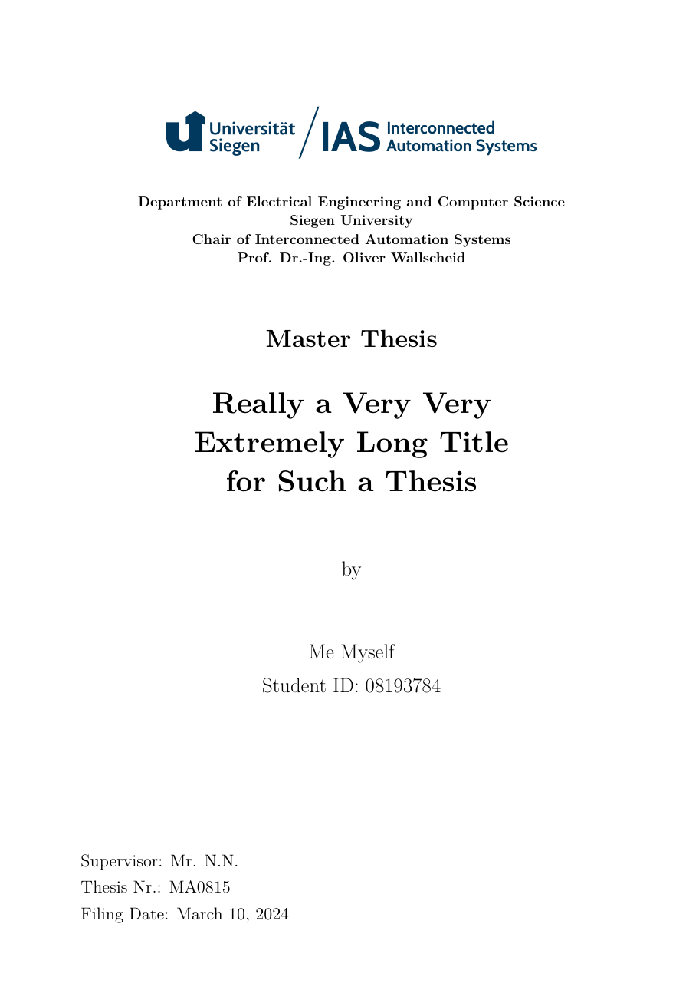

# thesis_latex_template
This is a latex document template for IAS students, writing a project report a thesis or a dissertation.

## Using the template
Run 'main.tex' using an LaTeX editor, e.g., TeXstudio.

## Overleaf
Create a new Project by importing the ZIP file from the GitHub release section (see right side on this page)!

Set the main document :
`Menu` -> `Main Document` -> `main.tex`

## TeXstudio
Change the compiler to `Latexmk`
`Options` -> `Configure TeXstudio` -> `Generate` -> default compiler: `Latexmk`

## Using own packages
Do not modify the `.cls` file. Add own LaTeX packages into the `chapters/header.tex`-file.

## Improvements and bugs
Please open an issue or pull request to suggest changes. Critical feedback and improvement hints are always welcome and highly appreciated!

## Preview

